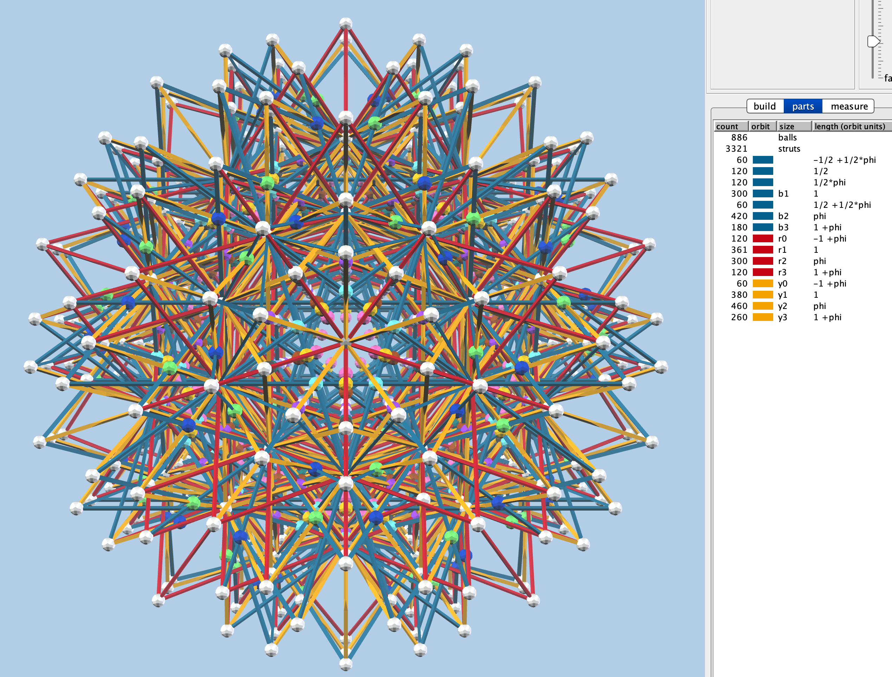

  This compound of 120 5-cells is shown with true polytope vertices in white,
  and false vertices (intersections created by the projection to 3D) in other colors.
  
  <vzome-viewer style="width: 100%; height: 60dvh" 
        src="https://vorth.github.io/vzome-sharing/2020/05/11/22-35-13-compound-120-5-cells-rZome/compound-120-5-cells-rZome.vZome" >
    
  </vzome-viewer>

  The parts list reveals that many of the blue struts here are half lengths.

  

[Source folder](<https://github.com/vorth/vzome-sharing/tree/main/2020/05/11/22-35-13-compound-120-5-cells-rZome/>)
