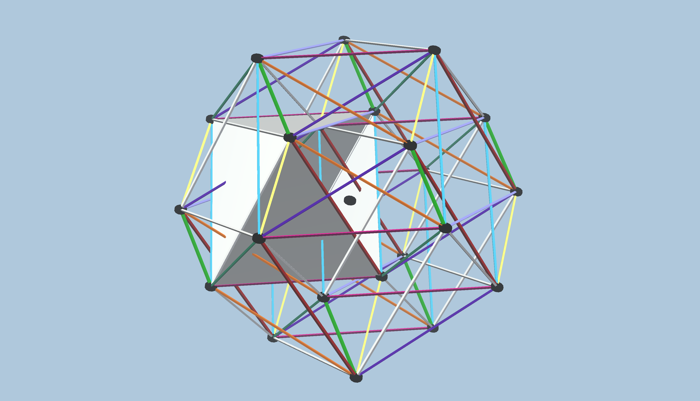

### 24-cell-root3.vZome

[vZome Online (immediate)][1] - this link works as soon as vZome has pushed the files to Github; it can be shared immediately, but it will not show a preview image when auto-expanded in Twitter, Discord, Facebook, etc.

[vZome Online (embeddable)][2] - this link may not work initially, since Github Pages may not be ready for a few minutes.  Once ready, this link is *great* for sharing on social media, since it will display the design title and a preview image.  Note that Github Pages only supports 20 updates in an hour, so you may have to wait up to an hour if you have shared more than 20 designs quickly.

[Github Source][3] - view this content as source in Github.  Feel free to edit `README.md` (this content), if you want to modify and share the page.

[Github Pages][4] - view this content as rendered in Github Pages.  Remember there may be a delay before changes appear here; see above.

[Hand-modified vZome Online][5] - this is a test of spaces in file names.

[1]: https://vzome.com/app/?url=https://raw.githubusercontent.com/vorth/vzome-sharing/master/2021/06/06/13-50-47/24-cell-root3.vZome
[2]: https://vzome.com/app/embed.py?url=https://vorth.github.io/vzome-sharing/2021/06/06/13-50-47/24-cell-root3.vZome
[3]: https://github.com/vorth/vzome-sharing/tree/master/2021/06/06/13-50-47
[4]: https://vorth.github.io/vzome-sharing/2021/06/06/13-50-47
[5]: https://vzome.com/app/?url=https://raw.githubusercontent.com/vorth/vzome-sharing/master/2021/06/06/24-cell%20root3.vZome
